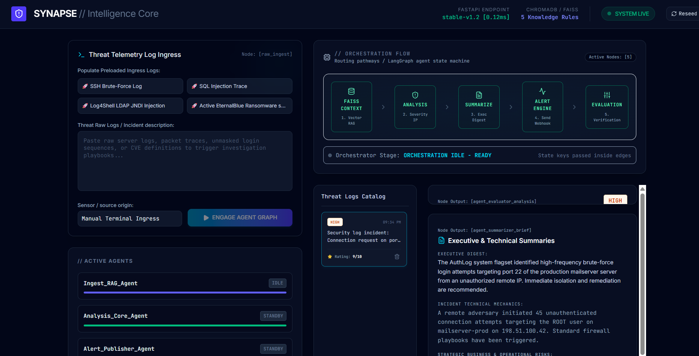
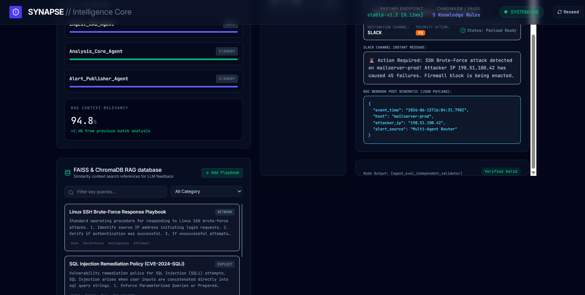
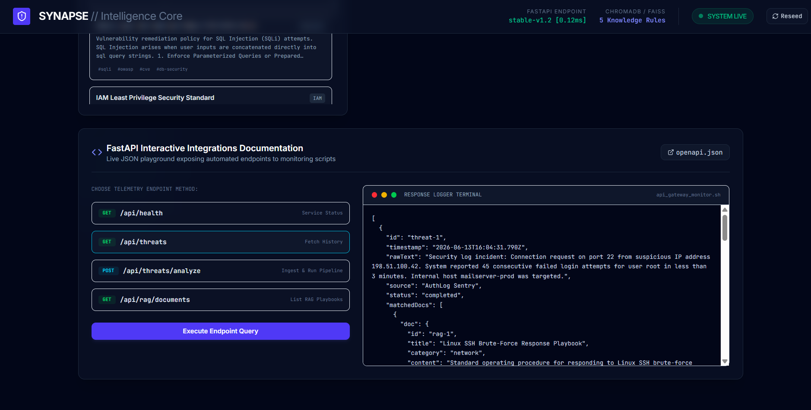

# Synapse: AI-Powered Multi-Agent Intelligence System

An enterprise-style **multi-agent cybersecurity intelligence platform** that combines **LangGraph orchestration, Retrieval-Augmented Generation (RAG), FAISS vector search, ChromaDB memory, and FastAPI services** to automate cyber threat investigation, contextual reasoning, alert generation, and remediation workflows.

The system ingests threat logs and incident telemetry, retrieves relevant contextual intelligence, routes findings between specialized AI agents, and produces executive summaries and monitoring-ready outputs.

---

## Preview

<p align="center">
  
</p>

---

## Problem Statement

Security analysts often struggle with:

- Alert fatigue
- Fragmented incident context
- Slow threat triage
- Manual remediation workflows
- Missing institutional knowledge

Traditional monitoring systems surface logs but rarely provide:

- contextual intelligence
- automated reasoning
- incident prioritization
- remediation recommendations

Synapse solves this problem using **multi-agent orchestration + RAG intelligence pipelines**.

---

## Key Features

### Multi-Agent Threat Intelligence System

Specialized agents collaborate to investigate threats:

#### Ingestion Agent
Processes:

- Threat reports
- Security logs
- Incident telemetry
- CVE reports

#### Analysis Agent
Performs:

- Threat interpretation
- Severity analysis
- IOC correlation
- Attack path reasoning

#### Summarization Agent
Generates:

- Executive summaries
- Technical incident breakdowns
- Risk assessments
- Recommended actions

#### Alerting Agent
Dispatches:

- Slack notifications
- Monitoring alerts
- Incident payloads
- Webhook events

#### Evaluation Agent
Validates:

- Response accuracy
- Context relevance
- Agent confidence
- Retrieval quality

---

## System Workflow

```text
Threat Logs / Security Events
                ↓
        Threat Ingestion Agent
                ↓
      FAISS + ChromaDB Retrieval
                ↓
        Context Enrichment Layer
                ↓
         LangGraph Orchestration
     ┌────────┬────────┬────────┐
     ↓        ↓        ↓        ↓
 Analysis  Summary  Alerting  Evaluation
     └────────┴────────┴────────┘
                ↓
     Monitoring Systems / APIs
```

---

## Tech Stack

| Category | Technologies |
|----------|--------------|
| Language | Python |
| Agent Framework | LangGraph |
| Retrieval | FAISS |
| Vector Database | ChromaDB |
| AI Architecture | RAG |
| Backend | FastAPI |
| APIs | REST |
| Monitoring | JSON APIs |
| Intelligence | Multi-Agent Systems |

---

# Platform Walkthrough

## 1. Multi-Agent Threat Intelligence Orchestration

The platform orchestrates multiple specialized AI agents using **LangGraph state routing**.

Capabilities include:

- Threat ingestion
- Agent collaboration
- Incident analysis
- Executive summarization
- Alert generation
- Agent evaluation

<p align="center">
  
</p>

---

## 2. FAISS/ChromaDB RAG Intelligence & Alerting

The system retrieves relevant historical threat context using **vector similarity search**.

Capabilities include:

- RAG context retrieval
- Playbook matching
- Incident enrichment
- Slack alerting
- Webhook payload generation
- Knowledge memory persistence

<p align="center">
  
</p>

---

## 3. FastAPI Monitoring & Intelligence APIs

FastAPI endpoints expose orchestration pipelines for integration with monitoring systems.

Supports:

- Threat ingestion APIs
- Incident analysis APIs
- Health monitoring
- Retrieval endpoints
- JSON telemetry output

<p align="center">
  
</p>

---

## Agent Architecture

```text
                     Security Events
                             │
                             ▼
                   Ingestion Agent
                             │
                             ▼
                FAISS + ChromaDB RAG
                             │
                             ▼
                 LangGraph Orchestrator
     ┌─────────────┬─────────────┬─────────────┐
     ▼             ▼             ▼             ▼
Analysis      Summarization    Alerting    Evaluation
 Agent            Agent          Agent        Agent
     └─────────────┴─────────────┴─────────────┘
                             │
                             ▼
                FastAPI Monitoring Endpoints
```

---

## Security Intelligence Capabilities

- Multi-Agent Threat Investigation
- RAG-Based Context Retrieval
- IOC Correlation
- CVE Context Matching
- Incident Summarization
- Threat Prioritization
- Slack/Webhook Alerting
- Monitoring Tool Integration
- Executive Security Reporting

---

## Example Threat Scenarios

The platform can investigate:

- SSH Brute Force Attacks
- SQL Injection Attempts
- LDAP Injection Attacks
- Ransomware Indicators
- Credential Abuse
- Suspicious Login Patterns
- CVE-Based Threats

---

## Results & Impact

The system enables teams to:

- Reduce analyst workload
- Improve incident triage
- Automate threat investigation
- Increase context relevance
- Accelerate remediation
- Standardize response workflows

---

## Future Improvements

- Kubernetes deployment
- Real-time SIEM integration
- Distributed vector search
- Multi-model routing
- Threat actor profiling
- Graph-based attack mapping

---
